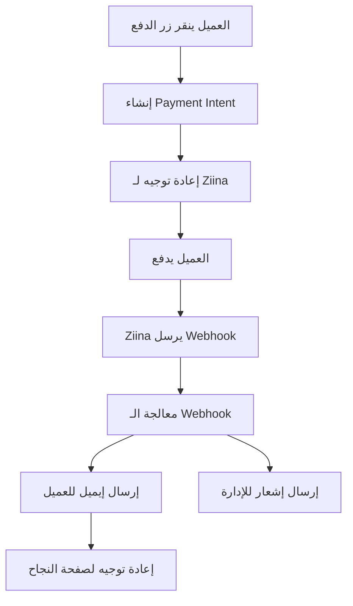

# 🚀 نظام الدفع المتكامل مع Ziina - متجر لفل اب

## 📋 نظرة عامة

تم تطوير نظام دفع متكامل وآمن باستخدام **Ziina Payment Gateway** مع دعم كامل للغة العربية وتجربة مستخدم محسنة.

## ✨ المميزات المطبقة

### 🔑 **المميزات الأساسية**
- ✅ **دمج Ziina Payment Intents** - إنشاء روابط دفع آمنة
- ✅ **نظام Webhook متقدم** - التحقق التلقائي من حالة الدفع
- ✅ **إرسال إيميلات تلقائية** - تأكيد الطلبات وإشعارات الإدارة
- ✅ **واجهة مستخدم محسنة** - مكونات React قابلة لإعادة الاستخدام
- ✅ **حماية متقدمة** - تشفير المفاتيح وإدارة آمنة للبيئة
- ✅ **دعم كامل للعربية** - RTL وترجمة شاملة
- ✅ **معالجة أخطاء ذكية** - رسائل واضحة ومفيدة

### 🛠️ **المميزات التقنية**
- ✅ **TypeScript** - أمان الأنواع والتطوير المحسن
- ✅ **React Hooks مخصصة** - `usePayment`, `useQuickPayment`
- ✅ **مكونات UI قابلة للتخصيص** - أزرار دفع متنوعة
- ✅ **إدارة حالة متقدمة** - تتبع حالة الدفع والأخطاء
- ✅ **تحقق من البيانات** - التحقق من صحة الإدخالات
- ✅ **تسجيل شامل** - مراقبة العمليات والأخطاء

## 🏗️ هيكل النظام

```
├── api/
│   ├── payment_intent.js     # إنشاء Payment Intent
│   └── webhook.js           # معالجة Webhooks من Ziina
├── lib/
│   ├── env.js              # إدارة متغيرات البيئة
│   ├── ziina.js            # مكتبة Ziina المحسنة
│   └── email.js            # نظام إرسال الإيميلات
├── src/
│   ├── hooks/
│   │   └── usePayment.ts   # Hooks للدفع
│   ├── components/
│   │   └── PaymentButton.tsx # مكونات أزرار الدفع
│   └── pages/
│       ├── PaymentSuccess.tsx # صفحة النجاح
│       └── PaymentCancel.tsx  # صفحة الإلغاء
└── .env.example            # قالب متغيرات البيئة
```

## 🔧 إعداد النظام

### 1️⃣ **متغيرات البيئة المطلوبة**

```bash
# 🔑 Ziina Payment Gateway (مطلوب)
ZIINA_SECRET_KEY=sk_test_your_secret_key_here
ZIINA_WEBHOOK_SECRET=whsec_your_webhook_secret_here

# 🌐 URLs (مطلوب)
NEXT_PUBLIC_BASE_URL=https://your-domain.com
VERCEL_URL=your-domain.vercel.app

# 📧 Email Service (مطلوب)
RESEND_API_KEY=re_your_resend_api_key_here

# 👨‍💼 إعدادات الإدارة (مطلوب)
ADMIN_EMAIL=admin@your-domain.com
SUPPORT_EMAIL=support@your-domain.com
STORE_NAME="متجر لفل اب"

# 🔒 الأمان (مطلوب)
JWT_SECRET=your_super_secure_jwt_secret_32_chars_min
```

### 2️⃣ **إعداد Ziina**

1. **إنشاء حساب**: سجل في [Ziina Business](https://business.ziina.com/)
2. **الحصول على المفاتيح**: اذهب إلى API Keys في لوحة التحكم
3. **إعداد Webhook**: أضف `https://your-domain.com/api/webhook`
4. **الأحداث المطلوبة**: `payment.completed`, `payment.failed`, `payment.canceled`

### 3️⃣ **إعداد Resend للإيميلات**

1. **إنشاء حساب**: سجل في [Resend](https://resend.com/)
2. **الحصول على API Key**: انسخ المفتاح من لوحة التحكم
3. **إضافة النطاق** (اختياري): لإرسال من نطاقك الخاص

## 💻 استخدام النظام

### **1. استخدام Hook الدفع**

```typescript
import { useQuickPayment } from '@/hooks/usePayment';

function ProductCard({ product }) {
  const { isLoading, error, quickPay } = useQuickPayment();

  const handlePurchase = async () => {
    const success = await quickPay({
      productName: product.name,
      productId: product.id,
      amount: product.price,
      customerEmail: 'customer@example.com',
      customerName: 'اسم العميل',
      description: `شراء: ${product.name}`
    });

    if (success) {
      console.log('تم توجيه العميل لصفحة الدفع');
    }
  };

  return (
    <button onClick={handlePurchase} disabled={isLoading}>
      {isLoading ? 'جاري المعالجة...' : `اشترِ الآن - ${product.price} درهم`}
    </button>
  );
}
```

### **2. استخدام مكون زر الدفع**

```typescript
import { PaymentButton } from '@/components/PaymentButton';

function ProductPage({ product }) {
  return (
    <div>
      <h1>{product.name}</h1>
      <p>{product.description}</p>
      
      {/* زر دفع بسيط */}
      <PaymentButton
        productName={product.name}
        productId={product.id}
        amount={product.price}
        description={product.description}
        showCustomerForm={false}
      />
      
      {/* زر دفع مع نموذج معلومات العميل */}
      <PaymentButtonWithCustomerInfo
        productName={product.name}
        productId={product.id}
        amount={product.price}
        description={product.description}
      />
    </div>
  );
}
```

### **3. استخدام API مباشرة**

```javascript
// إنشاء Payment Intent
const response = await fetch('/api/payment_intent', {
  method: 'POST',
  headers: {
    'Content-Type': 'application/json',
  },
  body: JSON.stringify({
    productName: 'منتج رقمي',
    amount: 99.99,
    customerEmail: 'customer@example.com',
    customerName: 'اسم العميل',
    description: 'وصف المنتج'
  }),
});

const result = await response.json();

if (result.success) {
  // إعادة توجيه للدفع
  window.location.href = result.data.redirectUrl;
}
```

## 🔄 تدفق العمليات

### **1. تدفق الدفع الناجح**



### **2. معالجة الـ Webhooks**

```javascript
// في api/webhook.js
export default async function handler(req, res) {
  const webhookData = req.body;
  
  // التحقق من التوقيع
  const isValid = ziinaGateway.verifyWebhookSignature(
    JSON.stringify(webhookData),
    req.headers['x-ziina-signature']
  );
  
  if (!isValid) {
    return res.status(401).json({ error: 'Invalid signature' });
  }
  
  // معالجة الحدث
  const result = await ziinaGateway.processWebhook(webhookData);
  
  res.status(200).json({ received: true, processed: true });
}
```

## 🧪 الاختبار

### **1. اختبار Payment Intent**

```bash
curl -X POST https://your-domain.com/api/payment_intent \
  -H "Content-Type: application/json" \
  -d '{
    "productName": "منتج تجريبي",
    "amount": 10,
    "customerEmail": "test@example.com",
    "customerName": "عميل تجريبي"
  }'
```

### **2. اختبار Webhook**

```bash
curl -X POST https://your-domain.com/api/webhook \
  -H "Content-Type: application/json" \
  -d '{
    "id": "pi_test_123",
    "status": "succeeded",
    "amount": 1000,
    "currency_code": "AED",
    "metadata": {
      "product_name": "منتج تجريبي",
      "customer_email": "test@example.com"
    }
  }'
```

### **3. اختبار الإيميلات**

```javascript
import emailService from '@/lib/email';

// اختبار إعدادات الإيميل
const testResult = await emailService.testEmailConfiguration();
console.log('نتيجة الاختبار:', testResult);
```

## 🔒 الأمان

### **حماية المفاتيح**
- ✅ جميع المفاتيح محفوظة في متغيرات البيئة
- ✅ لا توجد مفاتيح في الكود المصدري
- ✅ التحقق من Webhook Signatures
- ✅ تشفير JWT للروابط الآمنة

### **التحقق من الدفع**
- ✅ التحقق الرسمي عبر Webhooks
- ✅ عدم الاعتماد على إعادة التوجيه فقط
- ✅ تسجيل جميع العمليات
- ✅ معالجة الأخطاء بشكل آمن

### **حماية البيانات**
- ✅ تشفير البيانات الحساسة
- ✅ التحقق من صحة الإدخالات
- ✅ حماية من CSRF و XSS
- ✅ Rate Limiting للـ APIs

## 📊 المراقبة والتحليل

### **تسجيل العمليات**
```javascript
// تسجيل تلقائي لجميع العمليات
console.log('✅ تم إنشاء Payment Intent:', {
  paymentId: 'pi_123',
  amount: 99.99,
  currency: 'AED',
  timestamp: new Date().toISOString()
});
```

### **معالجة الأخطاء**
```javascript
// معالجة ذكية للأخطاء مع رسائل عربية
try {
  await createPaymentIntent(data);
} catch (error) {
  if (error instanceof ZiinaError) {
    toast.error(getArabicErrorMessage(error.message));
  }
}
```

## 🚀 النشر

### **1. Vercel (موصى به)**

```bash
# تثبيت Vercel CLI
npm i -g vercel

# نشر المشروع
vercel --prod

# إعداد متغيرات البيئة
vercel env add ZIINA_SECRET_KEY
vercel env add RESEND_API_KEY
# ... باقي المتغيرات
```

### **2. إعداد النطاق**

1. **ربط النطاق**: في لوحة تحكم Vercel
2. **تحديث URLs**: في متغيرات البيئة
3. **تحديث Webhook**: في لوحة تحكم Ziina

## 🔧 استكشاف الأخطاء

### **مشاكل شائعة**

#### **1. Payment Intent فشل**
```
Error: Failed to create payment intent
```
**الحل**: تحقق من `ZIINA_SECRET_KEY` في متغيرات البيئة

#### **2. Webhook لا يعمل**
```
Error: Invalid webhook signature
```
**الحل**: تحقق من `ZIINA_WEBHOOK_SECRET` وURL الـ Webhook

#### **3. الإيميلات لا ترسل**
```
Error: Failed to send email
```
**الحل**: تحقق من `RESEND_API_KEY` وإعدادات النطاق

#### **4. صفحات الدفع لا تظهر**
**الحل**: تحقق من `NEXT_PUBLIC_BASE_URL` في متغيرات البيئة

## 📞 الدعم

### **الموارد**
- 📖 **توثيق Ziina**: [docs.ziina.com](https://docs.ziina.com/)
- 📖 **توثيق Resend**: [resend.com/docs](https://resend.com/docs)
- 📖 **توثيق Vercel**: [vercel.com/docs](https://vercel.com/docs)

### **التواصل**
- 📧 **البريد الإلكتروني**: support@levelup-store.com
- 💬 **المجتمع**: [GitHub Discussions](https://github.com/your-repo/discussions)

## 📈 التطوير المستقبلي

### **المرحلة التالية**
- [ ] **قاعدة بيانات** - حفظ الطلبات والعملاء
- [ ] **ملفات رقمية** - نظام تحميل آمن
- [ ] **تحليلات متقدمة** - تتبع المبيعات والأداء
- [ ] **دعم عملات متعددة** - USD, EUR, SAR
- [ ] **اشتراكات** - دفعات دورية
- [ ] **كوبونات خصم** - نظام عروض وخصومات

### **تحسينات مقترحة**
- [ ] **PWA** - تطبيق ويب تقدمي
- [ ] **دفع بالتقسيط** - خيارات دفع مرنة
- [ ] **محفظة رقمية** - دعم Apple Pay, Google Pay
- [ ] **ذكاء اصطناعي** - توصيات منتجات ذكية

---

**تم إنشاؤه بواسطة**: فريق تطوير متجر لفل اب 🚀  
**آخر تحديث**: أكتوبر 2024  
**الإصدار**: 1.0.0
